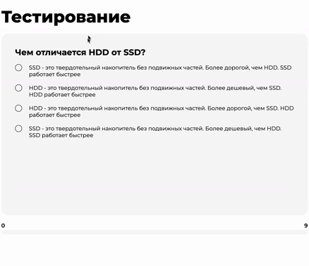

Тестовое задание для компании DIV — тест с результатами ответов.

## Стек

    [![Feature-Sliced Design][shields-fsd-domain]](https://feature-sliced.design/)

[shields-fsd-domain]: https://img.shields.io/badge/Feature--Sliced-Design?style=for-the-badge&color=F2F2F2&labelColor=262224&logoWidth=10&logo=data:image/png;base64,iVBORw0KGgoAAAANSUhEUgAAABQAAAAaCAYAAAC3g3x9AAAACXBIWXMAAALFAAACxQGJ1n/vAAAAAXNSR0IArs4c6QAAAARnQU1BAACxjwv8YQUAAABISURBVHgB7dKxCQAgDETR0w2cws0cys2cwhEUBbsggikCuVekDHwSQFlYo7Q+8KnmtHdFWMdk2cl5wSsbxGSZw8dm8pX9ZHUTMBUgGU2F718AAAAASUVORK5CYII=

## Запуск
1. Клонируйте репозиторий:

   `git clone https://github.com/alllenk1/quiz.git`
2. Перейдите в папку проекта:

   `cd quiz`
3. Установите зависимости:

   `npm install`
4. Запустите проект:

   `npm run dev`

## Что сделано

-   Вопросы и ответы в тесте выводятся в рандомном порядке;
-   Под тестом есть прогрессбар, он корректно работает с любым количеством вопросов;
-   При выводе результатов правильные ответы отмечаются зеленым, неверные — красным;
-   Между вопросами есть задержка в 1 сек.
